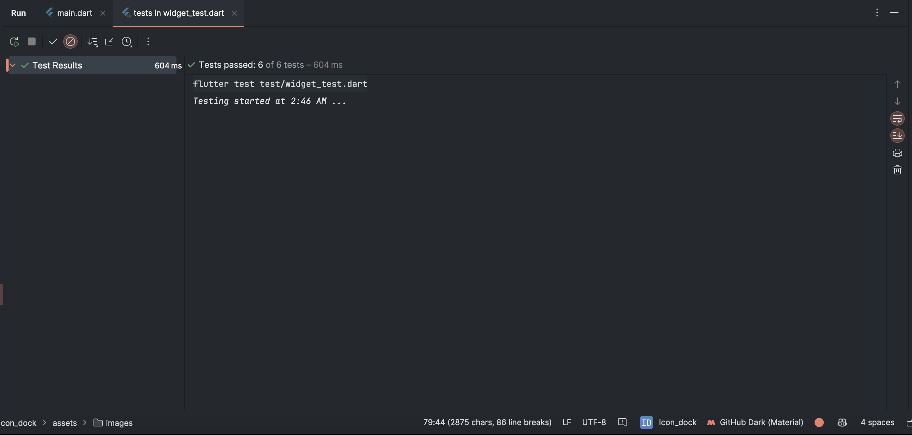

# Icon_Dock

Welcome to **Icon_Dock**, an elegant and customizable dock implementation inspired by macOS, designed specifically for Flutter applications. This project serves as a showcase for developing a visually appealing dock featuring draggable and sortable icons, elevating the user experience through intuitive design and animation.

## Features

- **Drag-and-Drop Functionality**: Seamlessly reorder icons within the dock with simple drag-and-drop interactions, allowing users to personalize their experience.
- **Customizable Appearance**: Tailor the look of dock icons according to individual preferences, enhancing aesthetic appeal and usability.
- **Smooth Animations**: Enjoy fluid transitions and animations when rearranging icons, contributing to a polished and engaging interface.
- **Responsive Layout**: The dock adapts gracefully to various screen sizes and orientations, ensuring a consistent experience across different devices.

## Getting Started

To set up and run **Icon_Dock**, follow these steps:

### Prerequisites

Ensure you have Flutter installed on your machine. You can verify your installation by executing:

```bash
flutter --version
```
### Clone the Repository

Use the following command to clone the project:

```bash
git clone git@github.com:Adonias-hibeste/Icon_dock.git
```
### Navigate to the Project Directory

Change your directory to the project folder:

```bash
cd Icon_dock
```
### Install Dependencies

Fetch the required packages:

```bash
flutter pub get
```
### Run the Application

Start the app with the following command:
```bash
flutter run -d chrome
```
## Usage Example

You can easily customize the main Dock widget by specifying various icons and styles. Here’s an illustrative example:
```bash
Dock<IconData>(
  items: const [
    Icons.person,
    Icons.message,
    Icons.call,
    Icons.camera,
    Icons.photo,
  ],
  builder: (IconData icon, bool isDragging) {
    return DockItem(
      icon: icon,
      isDragging: isDragging,
    );
  },
);

```
## Screenshots

Here are some screenshots of **Icon_Dock** on different devices:

<div style="display: flex; flex-wrap: wrap; gap: 10px;">

<div style="flex: 1; min-width: 200px;">
  
  <p style="text-align: center;">Screenshot on Android</p>
</div>

<div style="flex: 1; min-width: 200px;">
  
  <p style="text-align: center;">Screenshot on macOS</p>
</div>

<div style="flex: 1; min-width: 200px;">
  
  <p style="text-align: center;">Screenshot on Chrome</p>
</div>


</div>


## Testing Region

To ensure the quality and functionality of Icon_Dock, we've written some tests. Here's a highlight of what we have done:

**Test Coverage:**

* **Widget Construction:** Ensures that core widgets like `MyApp` and `HomePage` build successfully without errors.
* **Theming:** Verifies that the app adheres to the defined theme (e.g., white background for the app bar).
* **Component Presence:** Confirms that essential components like `AppBar` and `Dock` are present in the expected locations.
* **State Management:** Tests the behavior of the `Dock` widget, especially when added or removed, ensuring proper ticker handling for animations.
* **Integration Flow:** Simulates a comprehensive user interaction scenario involving dragging icons within the dock to reorder them.


**Test Results:**



## Contribution
Contributions to Icon_Dock are welcome! If you have suggestions or improvements, please fork the repository and submit a pull request. You can also open an issue if you encounter any bugs or have feature requests.

#Steps to Contribute
1. Fork the repository.
2. Create a new branch (git checkout -b feature/YourFeature).
3. Make your changes.
4. Commit your changes (git commit -m 'Add some feature').
5. Push to the branch (git push origin feature/YourFeature).
6. Open a pull request.


## Conclusion
Icon_Dock exemplifies how to create a functional and customizable dock using Flutter. With its intuitive drag-and-drop capabilities and engaging animations, it significantly enhances the overall user experience.

For any questions, suggestions, or contributions, feel free to open an issue or submit a pull request on the GitHub repository.
